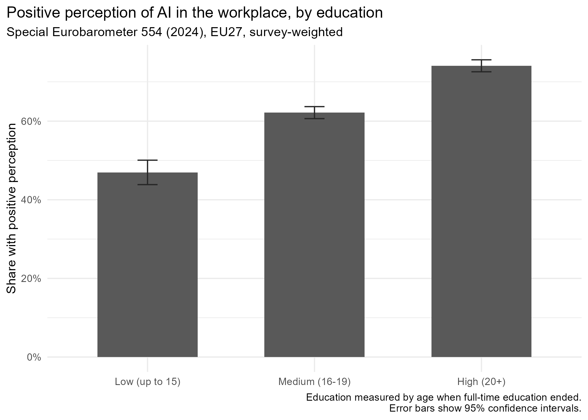
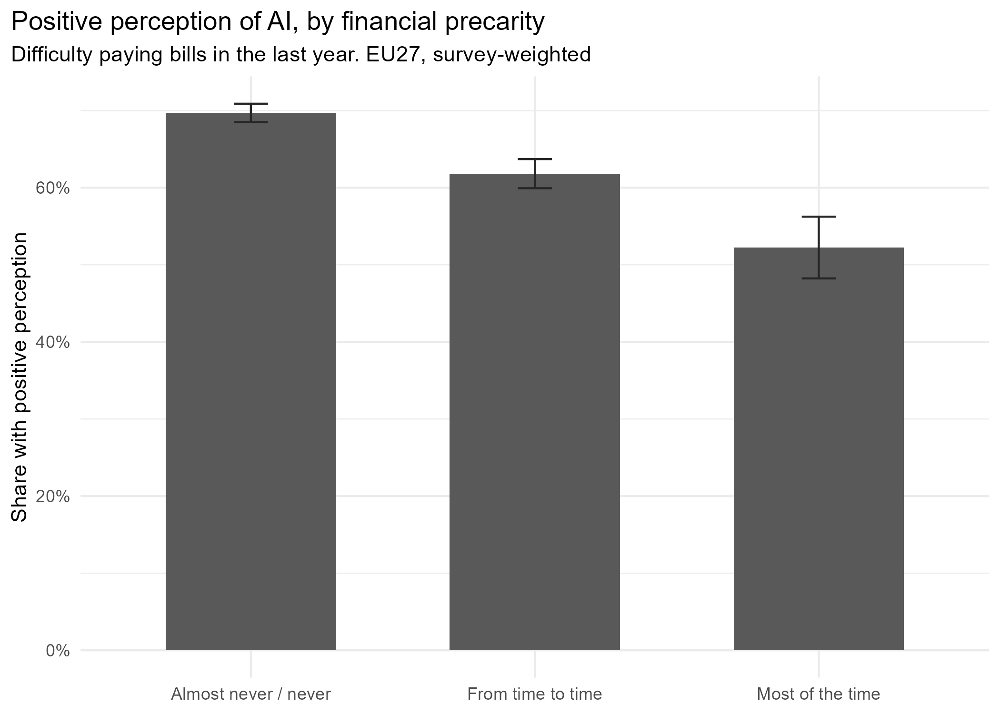
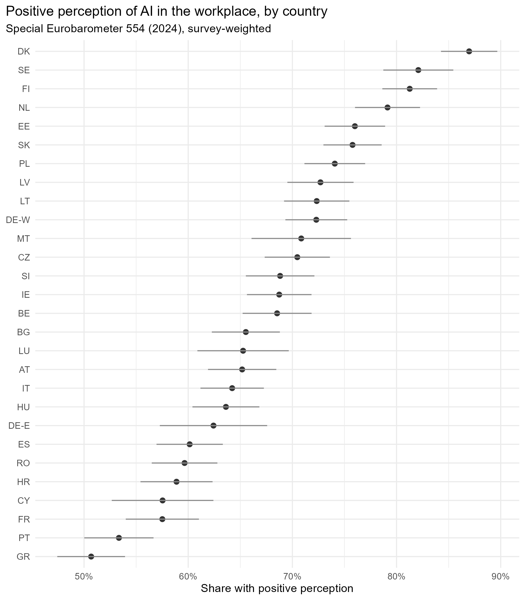

# Who Accepts AI at Work?

### Socioeconomic inequalities in workplace AI attitudes across the European Union

Independent quantitative research project using Special Eurobarometer 554 to examine how digital competence, financial precarity, education and workplace exposure to AI are associated with public attitudes toward artificial intelligence at work.

**Author:** Patricia Cruz  
**Affiliation:** MSc Computational Social Science, Linköping University  
**Status:** Independent research project / working paper in progress

---

## Research question

Which socioeconomic and experiential factors are associated with positive perceptions of artificial intelligence in the workplace across the European Union?

The project focuses particularly on:

- education
- self-rated digital competence
- financial precarity
- prior workplace exposure to AI systems
- age
- gender
- community type
- cross-national differences

Because the data are cross-sectional, the analysis focuses on associations rather than causal effects.

---

## Data

The analysis uses **Special Eurobarometer 554 / Eurobarometer 101.4 (2024)**.

- **GESIS study:** ZA8844
- **Fieldwork:** 25 April to 22 May 2024
- **Sample:** 26,404 respondents
- **Coverage:** EU27
- **Unit of analysis:** individual respondents

The survey includes a dedicated module on artificial intelligence and the future of work, covering attitudes toward workplace AI, self-rated digital competence and prior exposure to AI-supported workplace practices.

The original microdata are not included in this repository. They can be obtained from the GESIS Data Archive.

DOI: `10.4232/1.14471`

---

## Main variables

### Outcome

`qb5`

Overall perception of robots and artificial intelligence in the workplace.

Responses are coded as:

- 1 = Very positively
- 2 = Fairly positively
- 3 = Fairly negatively
- 4 = Very negatively

For the main analysis, responses 1 and 2 are coded as positive perception, while responses 3 and 4 are coded as negative perception.

Don't know responses are treated as missing.

### Education

Education is measured using age when full-time education ended.

The main categories are:

- Low, up to age 15
- Medium, ages 16 to 19
- High, age 20 or later
- Still studying
- No full-time education

### Digital competence

Self-rated digital competence is derived from `qb2_1`.

The original scale is reversed so that higher values indicate greater self-rated competence.

### Financial precarity

Financial precarity is measured using reported difficulty paying household bills during the previous year.

Categories are:

- Almost never / never
- From time to time
- Most of the time

### Workplace AI exposure

Workplace AI exposure is constructed from the `qb7_*` battery.

Respondents are classified as frequently exposed when they report AI being used "all the time" or "often" in at least one workplace activity covered by the survey.

Respondents with no valid information across the exposure items are treated as missing rather than as unexposed.

### Country

Country fixed effects are included in the fully adjusted regression model.

East and West German samples are combined for country-level descriptive analysis using the dedicated Germany weight supplied by Eurobarometer.

---

## Methods

The analysis is conducted in R.

Methods include:

- survey-weighted descriptive statistics
- country comparisons
- survey-weighted logistic regression
- nested regression models
- country fixed effects
- odds ratios
- 95% confidence intervals
- robustness checks using unweighted models
- robustness checks using a restricted education sample

EU-level estimates use the Eurobarometer EU27 population weight, `w22`.

Country-level estimates use national weights, with `w1de` used when East and West Germany are combined.

The main regression specification includes:

- education
- age
- gender
- financial precarity
- community type
- digital competence
- workplace AI exposure
- country fixed effects

---

## Descriptive results

Approximately **66%** of respondents across the EU27 report a positive perception of robots and artificial intelligence in the workplace.

### Education



Positive attitudes increase substantially with education.

In the survey-weighted descriptive analysis:

- 47.0% among respondents who left full-time education at age 15 or younger
- 62.2% among respondents who left between ages 16 and 19
- 74.1% among respondents who remained in education until age 20 or later

Respondents who were still studying had the highest positive perception, at approximately 81%.

---

## Financial precarity



Positive attitudes decline as financial difficulty increases.

- 69.7% among respondents who almost never or never experience difficulty paying bills
- 61.8% among those who experience difficulty from time to time
- 52.2% among those who experience difficulty most of the time

---

## Cross-national variation



Attitudes toward workplace AI vary substantially across the EU27.

Positive perception ranges from approximately:

- 87.0% in Denmark
- 82.1% in Sweden
- 81.3% in Finland

to:

- 57.5% in France
- 53.3% in Portugal
- 50.7% in Greece

Germany is treated as a single country in this comparison by combining the East and West German samples with the dedicated Germany weight.

---

## Regression analysis

Three nested survey-weighted logistic regression models are estimated.

### Model 1

Includes demographic and socioeconomic characteristics:

- education
- age
- gender
- financial precarity
- community type

### Model 2

Adds:

- self-rated digital competence
- workplace AI exposure

### Model 3

Adds country fixed effects and is treated as the main specification.

---

## Main findings

In the fully adjusted model, self-rated digital competence is strongly associated with positive workplace AI attitudes.

A one-point increase in the four-point competence scale is associated with approximately **2.16 times the odds** of positive AI perception.

**OR = 2.16, 95% CI [2.01, 2.31]**

Prior workplace exposure to AI is also strongly associated with positive attitudes.

Respondents reporting frequent workplace AI exposure have approximately **2.11 times the odds** of positive AI perception compared with respondents without frequent exposure.

**OR = 2.11, 95% CI [1.88, 2.37]**

The large descriptive education gradient becomes substantially smaller after digital competence, AI exposure and country differences are taken into account.

Respondents in the highest education category nevertheless retain moderately higher odds of positive perception than respondents in the lowest education category.

**OR = 1.32, 95% CI [1.07, 1.62]**

Frequent financial difficulty remains negatively associated with workplace AI attitudes.

Respondents who report difficulty paying bills most of the time have approximately one-third lower odds of positive AI perception than respondents who almost never or never experience such difficulty.

**OR = 0.67, 95% CI [0.54, 0.83]**

Age is not independently associated with workplace AI perception in the fully adjusted model.

---

## Robustness checks

Two robustness analyses were conducted.

First, the fully adjusted model was re-estimated without survey weights.

The main associations remained similar:

- Digital competence: OR = 1.97, 95% CI [1.90, 2.05]
- Workplace AI exposure: OR = 2.03, 95% CI [1.90, 2.18]
- High education: OR = 1.35, 95% CI [1.18, 1.54]
- Frequent financial precarity: OR = 0.62, 95% CI [0.54, 0.70]

Second, the survey-weighted analysis was restricted to respondents in the three principal education categories, excluding respondents who were still studying or reported no full-time education.

The main associations again remained similar:

- Digital competence: OR = 2.22, 95% CI [2.07, 2.38]
- Workplace AI exposure: OR = 2.12, 95% CI [1.89, 2.39]
- High education: OR = 1.29, 95% CI [1.04, 1.60]
- Frequent financial precarity: OR = 0.66, 95% CI [0.52, 0.82]

These results suggest that the principal findings are not driven solely by survey weighting or by the inclusion of atypical education categories.

---

## Missing data

The full dataset contains 26,404 respondents.

There are 24,753 respondents with a valid workplace AI attitude outcome.

The fully adjusted regression model uses 19,739 complete cases.

Workplace AI exposure contains 3,147 missing observations after respondents without valid exposure information are correctly classified as missing.

The analysis therefore does not assume that respondents with missing workplace exposure information were unexposed.

---

## Limitations

This study uses cross-sectional survey data and therefore cannot identify causal effects.

The results should be interpreted as associations.

Self-rated digital competence may reflect perceived competence rather than objectively measured digital ability.

Education is measured using age at completion of full-time education rather than a harmonised qualification scale.

The workplace AI exposure variable captures reported exposure and may also reflect selection into particular occupations, industries or workplaces.

The main regression relies on complete-case analysis, reducing the analytic sample relative to the full survey sample.

Finally, substantial cross-national heterogeneity means that pooled EU-level associations should not be interpreted as identical relationships within every country.

---

## Reproducibility

The full analysis is contained in:

`analysis.R`

Running the script generates:

- descriptive statistics
- country comparisons
- regression estimates
- robustness checks
- figures
- tables
- R session information

Generated outputs are stored in:

```text
output/
├── figures/
└── tables/


To reproduce the analysis:

Obtain ZA8844 from the GESIS Data Archive.
Download the SPSS .sav version.
Place the file inside the data/ directory.
Run analysis.R.
Render report.qmd.
Repository structure
.
├── README.md
├── analysis.R
├── report.qmd
├── references.bib
├── codebook_notes.md
├── data/
│   └── README.md
├── output/
│   ├── figures/
│   └── tables/
└── docs/
Research output

The full research report is available in:

report.qmd

The project is being developed as an independent working paper in Computational Social Science.

Data citation

European Commission, Brussels. Eurobarometer 101.4, April-May 2024. Verian, Brussels [Producer]. GESIS, Cologne [Publisher]. ZA8844, dataset version 1.0.0.

DOI: 10.4232/1.14471

License

Analysis code is provided for research and educational use.

The underlying Eurobarometer microdata are not redistributed and remain subject to GESIS terms of use.
